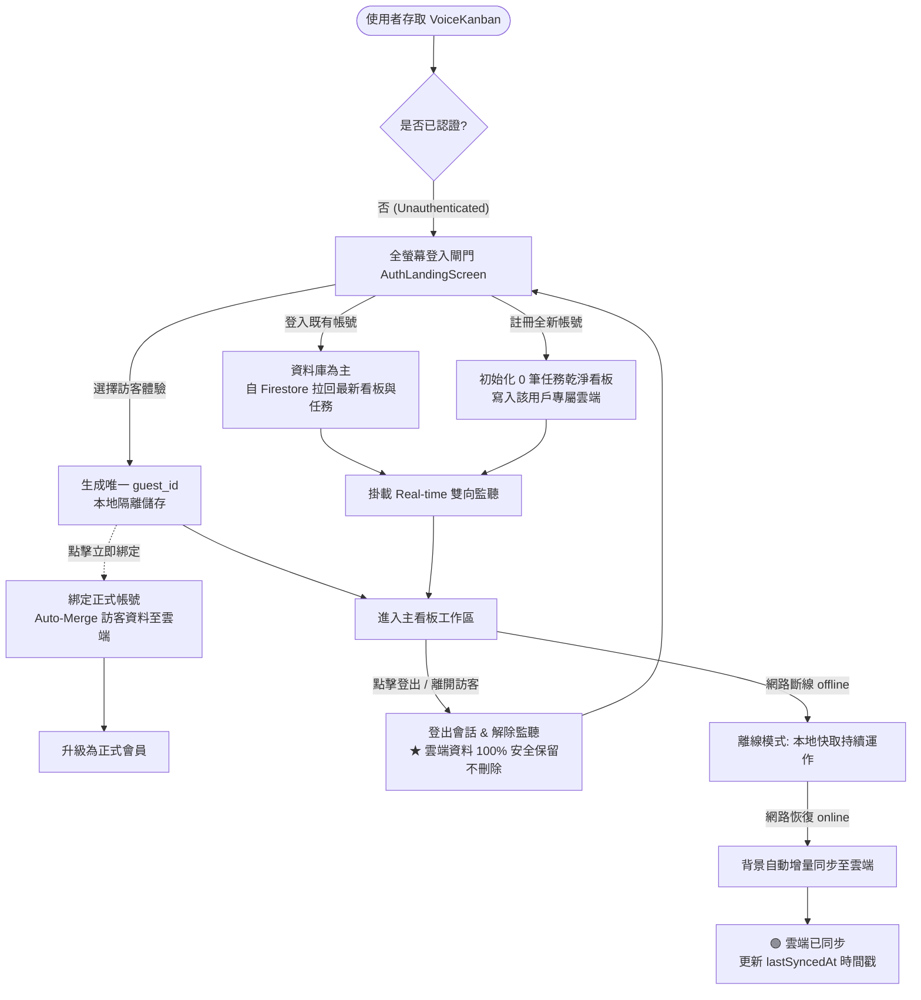

# VoiceKanban 登入閘門、訪客體驗、雲端同步與精確時間指示規格書 (PRD.md v3.2.0)

> **版本**：v3.2.0 (Auth Gatekeeper, Guest Mode & Enhanced Sync Timestamp Indicator)  
> **負責人**：`@PM`  
> **決策共識 (Grill Me 結論)**：
> 1. **時間呈現格式 (方案 A)**：動態人性化相對時間 ＋ 精確懸浮提示（剛同步完 1 分鐘內顯示「剛剛（目前為最新）」；數分鐘至數小時顯示「X 分鐘前」、「今天 HH:mm」；懸浮/點擊提示完整時間戳記）。
> 2. **狀態矩陣文案**：四態清晰對應（🟢 雲端已同步 / 🔄 正在同步... / ☁️ 離線模式 / ⚠️ 同步異常）。
> 3. **訪客模式差異化**：訪客模式顯示「本機已存檔」，副標題呈現最後儲存時間並導引登入同步。

## 🔄 核心資料流程架構 (Core Data Flow Specification)

---

## 🎯 核心驗收標準 (Acceptance Criteria)

### 1. 登入流程 (Sign In / Registration Flow) (AC-1)
- **[AC-1.1] 既有會員登入（以資料庫為主）**：登入已有資料的會員帳號時，系統直接自雲端資料庫（Firestore）撈取最新看板與任務卡片還原畫布，並即時建立跨裝置 `onSnapshot` 雙向監聽。
- **[AC-1.2] 註冊全新帳號（0 筆任務乾淨狀態）**：新註冊帳號時，任務清單完全為空（`tasks: []`），提供標準工作流看板結構，並將乾淨狀態存入該帳號專屬資料庫。
- **[AC-1.3] 閘門流轉**：未登入時由全螢幕 `AuthLandingScreen` 阻擋，登入成功後平滑進入看板。

---

### 2. 登出流程 (Sign Out Flow) (AC-2)
- **[AC-2.1] 雲端資料完整保留**：登出操作僅中斷本地會話與即時監聽，**用戶在雲端資料庫（Firestore）的所有看板與卡片 100% 永久完整保存，絕不刪除**。
- **[AC-2.2] 安全重定向**：登出後重設會話狀態為 `isAuthenticated: false`，立即安全返回全螢幕 `AuthLandingScreen`，等待下一次登入。

---

### 3. 訪客模式與升級綁定 (Guest Mode & Upgrade) (AC-3)
- **[AC-3.1] 獨立唯一訪客 ID**：選擇訪客進入時生成獨立 ID（`guest_xxxx`），支援免登入直接體驗。
- **[AC-3.2] 主動升級綁定 (Auto-Merge)**：訪客在右上角選單點擊「立即綁定正式帳號」時，系統將訪客期間的所有自訂看板與卡片無縫整併至該 Google/Email 正式帳號的雲端資料庫中，資料零遺失。
- **[AC-3.3] 訪客切換既有帳號**：若訪客點擊「切換為會員登入」，則以目標帳號在資料庫的資料為主（不污染目標帳號）。

---

### 4. 離線模式與自動復網同步 (Offline & Auto-Reconnect) (AC-4)
- **[AC-4.1] 動態網路監聽**：即時監聽瀏覽器 `online` 與 `offline` 事件。
- **[AC-4.2] 離線操作無阻**：斷網時自動切換至「離線模式」，所有卡片建立、移動與修改操作均在本地快取順暢運行。
- **[AC-4.3] 復網自動同步**：當網路恢復連線時，系統自動觸發背景同步，將離線異動上傳至雲端資料庫，並切換回「🟢 雲端已同步」。

---

### 5. UI 5 種狀態規範 (AC-5)
- **[AC-5.1] Loading**：OAuth 授權中、資料庫合併與同步中顯示 Spinner / Skeleton。
- **[AC-5.2] Empty**：空看板與初始範本導引。
- **[AC-5.3] Error**：密碼不合規、帳號已存在、網路異常等中文友善提示。
- **[AC-5.4] Success**：綁定成功與同步完成 Toast 提示。
- **[AC-5.5] Active**：綁定彈窗、登入頁互動切換。

---

### 6. Profile 同步狀態與最後同步時間指示 (AC-6)
- **[AC-6.1] 即時動態人性化時間 (Humanized Relative Time)**：
  - 1 分鐘內：顯示「剛剛（目前為最新）」
  - 1 分鐘至 60 分鐘內：顯示「X 分鐘前」
  - 超過 1 小時但為今天：顯示「今天 HH:mm」
  - 跨日：顯示「MM/DD HH:mm」
- **[AC-6.2] 精確時間懸浮 (Tooltip)**：
  - 滑鼠懸浮在同步區塊時，顯示完整 ISO 轉換之時間標籤（如 `2026/08/28 10:15:30`）。
- **[AC-6.3] 狀態矩陣多態呈現 (State Matrix)**：
  - 🟢 **雲端已同步**：標題「雲端已同步」，副標題「剛剛（目前為最新）」或「X 分鐘前」。
  - 🔄 **正在同步...**：標題「正在同步...」，副標題「正在更新雲端資料」，附旋轉動畫圖示。
  - ☁️ **離線模式**：標題「離線模式」，副標題「上次同步於 HH:mm・連線後自動上傳」。
  - ⚠️ **同步異常**：標題「同步異常」，副標題「上次同步於 HH:mm・點擊立即同步重試」。
- **[AC-6.4] 訪客本機狀態**：若為訪客，標題顯示「本機已存檔」，副標題顯示「剛剛（本機模式）」，按鈕引導「立即同步/備份」。
