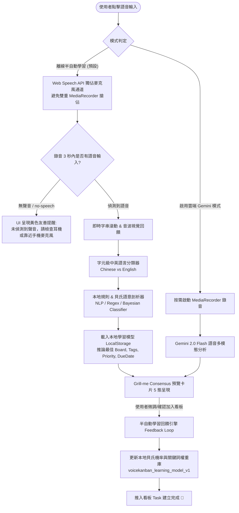

# VoiceKanban 離線語音辨識與半自動雙語學習引擎規格書 (PRD.md v4.1.0)

> **版本**：v4.1.0 (Audio Stream Optimization & Silence Detection Engine)  
> **負責人**：`@PM`  
> **決策共識 (Grill Me 結論)**：
> 1. **語音辨識核心 (方案 A)**：瀏覽器原生 `Web Speech API (webkitSpeechRecognition)` 搭配智慧雙軌容錯與字元級中英文自動判定，零雲端 AI API 依賴。
> 2. **音訊串流單一化 (v4.1.0 優化)**：離線模式下由 Web Speech API 獨佔麥克風通道，杜絕 `getUserMedia` 與 `SpeechRecognition` 雙重硬體鎖定競爭，徹底解決電腦藍牙耳機與手機行動端收音失敗問題。
> 3. **無聲智慧偵測與引導 (v4.1.0 優化)**：錄音啟動後 3 秒內若無字元輸入或收到 `no-speech` 訊號，立即顯示友善指引提示（檢查耳機輸入裝置或對準手機麥克風）。
> 4. **半自動學習機制**：本地輕量貝氏分類 (Naive Bayes) + 使用者糾錯回饋學習 (Correction Feedback Loop)。
> 5. **中英文分流規則**：自動判定中英雙語，自動掛載 `#繁中` / `#English` 標籤並執行在地化時間語意剖析。
> 6. **雙模共存**：支援「純本地離線學習模式」與「Gemini 2.0 多模態推理」，無 API Key 時自動進入離線半自動學習模式。

---

## 🔄 核心資料流程架構 (Core Data Flow Specification)

---

## 🎯 核心驗收標準 (Acceptance Criteria)

### 1. 音訊串流單一化與耳機相容性 (AC-5.1)
- **[AC-5.1.1] 獨佔式音訊存取**：離線學習模式（預設）下，僅呼叫 Web Speech API 啟動辨識，禁止同時開啟 `getUserMedia` 重複佔用音訊硬體，避免藍牙耳機（HFP）或手機 Safari/Chrome 發生 Audio Capture Lock 衝突。
- **[AC-5.1.2] 按需雲端錄音**：僅在使用者啟用雲端 Gemini 模式且具備有效 API Key 時，才調用 `getUserMedia` / `MediaRecorder` 採集音訊。
- **[AC-5.1.3] 資源釋放乾淨**：關閉或完成錄音時，確保完全終止所有 AudioTrack 與 SpeechRecognition 實例，不殘留背景錄音狀態。

---

### 2. 3秒無聲自動提示與智慧引導 (AC-5.2)
- **[AC-5.2.1] 3秒無聲檢測**：錄音開始後，若連續 3 秒內逐字稿依然為空或收到 `no-speech` 事件，UI 即時浮現引導提示：「⚠️ 未偵測到聲音，請檢查系統輸入裝置（耳機麥克風）或對著手機麥克風說話」。
- **[AC-5.2.2] 自動恢復機制**：一旦接收到有效語音逐字稿，無聲警告立即自動隱藏，切換為即時串流文字。
- **[AC-5.2.3] 權限被拒與硬體異常提示**：明確區分 `not-allowed`（權限被拒）、`audio-capture`（麥克風裝置異常/佔用）與 `network`，給予精確中文指引。

---

### 3. 離線語音辨識與雙語即時分類 (AC-1)
- **[AC-1.1] 零 API 依賴辨識**：在無 Gemini API Key 或無網路狀態下，點擊錄音即啟動瀏覽器原生 Web Speech API，即時輸出語音辨識逐字稿。
- **[AC-1.2] 中英雙語自動判定**：
  - 中文字元比率 \(\ge 20\%\) 或含繁簡中文 Unicode 區段者分類為 `zh-TW`（中文）。
  - 否則且包含拉丁英文字母者分類為 `en-US`（英文）。
  - 自動於任務標籤掛載對應語系標籤（`#繁中` 或 `#English`）。
- **[AC-1.3] 瀏覽器相容與防呆**：若瀏覽器不支援 Web Speech API，優雅降級為手動輸入並給予友善提示，絕不崩潰。

---

### 4. 本地語意剖析與規則推論 (AC-2)
- **[AC-2.1] 中文時間與優先級萃取**：
  - 支援「今天」、「明天」、「後天」、「下週一/二/三/四/五」、「下午/早上 X 點」自動轉換為 ISO 到期時間。
  - 支援「緊急」、「重要」、「高優先」、「隨便」、「低優先」等關鍵字判定 `high` / `medium` / `low`。
- **[AC-2.2] 英文時間與優先級萃取**：
  - 支援 *today*, *tomorrow*, *next monday*, *at 3pm*, *urgent*, *asap*, *high priority*, *low priority* 等自動轉換。
- **[AC-2.3] 看板自動匹配**：依據口述內容比對現有看板名稱與欄位名稱（如口述「放進工作日常進行中」自動選定對應看板與欄位）。

---

### 5. 半自動學習引擎與回饋機制 (Active Feedback Learning) (AC-3)
- **[AC-3.1] 糾錯回饋學習 (Correction Reinforcement)**：
  - 當使用者在預覽確認介面修改了標題、目標看板、欄位、優先級或自訂標籤，點擊「確認加入」時，系統自動將口述特徵詞彙與使用者的最終修正寫入學習記憶庫。
- **[AC-3.2] 輕量樸素貝氏模型 (Naive Bayes Classifier)**：
  - 本地維護詞彙條件機率矩陣，隨使用次數增加，針對特定詞彙（例如「Bug」自動傾向「工作日常/進行中/高優先」）的預測準確度自動提升。
- **[AC-3.3] 學習模型持久化與透明管理**：
  - 學習權重儲存於 `localStorage`（鍵值 `voicekanban_learning_model_v1`）。
  - 設定面板中提供「已學習詞彙統計」與「重設學習模型」功能。

---

### 6. UI 5 種狀態規範 (AC-4)
- **[AC-4.1] Loading / Listening**：錄音中（波形動態反饋、即時字串滾動、語系辨識中 Badge）。
- **[AC-4.2] Empty / Warning**：未接收到聲音或滿 3 秒無音訊時提示「⚠️ 未偵測到聲音，請檢查系統輸入裝置（耳機麥克風）或對著手機麥克風說話」。
- **[AC-4.3] Error**：麥克風權限被拒絕或瀏覽器不支援時的指引介面。
- **[AC-4.4] Success**：加入成功發射 Confetti 粒子並提示「已記錄學習反饋 ✨」。
- **[AC-4.5] Active / Preview**：預覽卡片提供中英語系切換指示、逐字稿顯示、欄位可即時微調。
